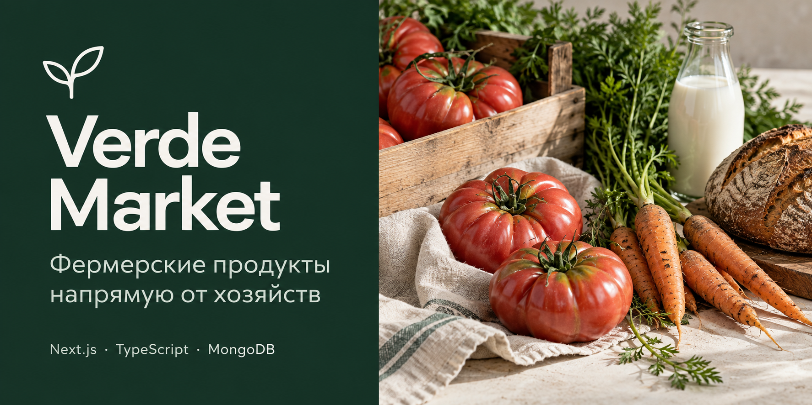

# Verde Market

Маркетплейс фермерских продуктов с каталогом, корзиной и оформлением заказов у нескольких продавцов. Покупатели отслеживают доставку, фермеры управляют товарами и заказами, администратор проверяет магазины и публикации.

**Стек:** Next.js, React, TypeScript, MongoDB, Mongoose, Zustand, Zod.

Проект построен как модульный монолит: предметные модули отделены от HTTP-маршрутов и интерфейса. Оформление заказа и возврат остатков выполняются в транзакциях MongoDB; повторные запросы защищены от повторного списания.

Оплата — продавцу при получении. Гостевое отслеживание заказов работает по токену, сохранённому в браузере.
